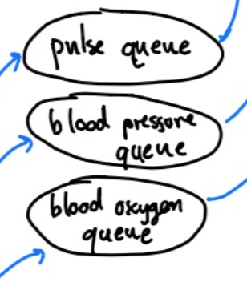
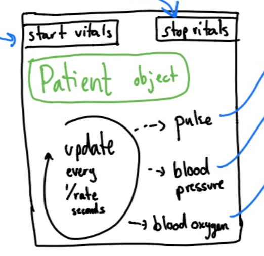
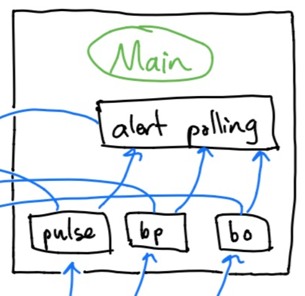
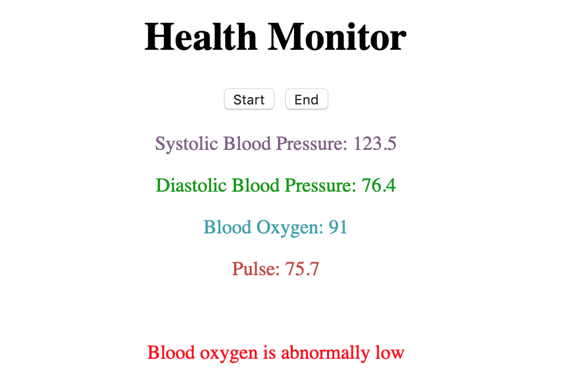
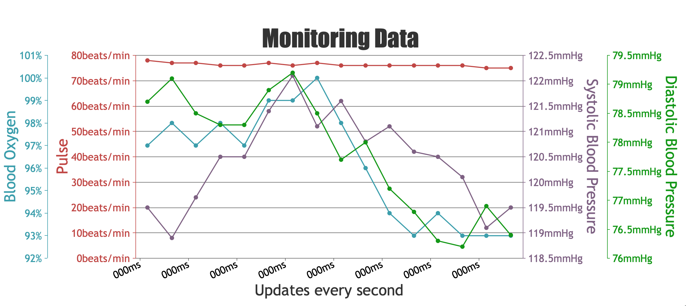

# EC500: Health Monitor Project
Alex Fatyga, Chris Jung, Jacob Davis, Justin Morgan, Noah Malhi, Varun Malikayil

# Summary
The Healthy Healthy Hippos ICU monitor is a web application that runs on the local host. It displays values for the three vitals, both at the top as well as graphs at the bottom. The alerts appear in red between the current value display and the graphs at the bottom.

# Usage Instructions
1. Clone the repository.
2. Run main.py.
3. Access the following url in your browser (localhost) to view the web application: http://127.0.0.1:5000/
4. Press the 'Start' button.
5. Press 'End' when you are done.

# Project Roles
* Alex: Health Indicator web interface
* Chris: Error Handling
* Jacob: Alerts, Patient classes, Integrating Architecture
* Justin: BP Module, Communication With Personal Device
* Noah: Pulse Module in the Patient class
* Varun: Blood Oxygen in Patient class

# Architecture
## Overview

## Queues

Three queues to which vitals values can be pushed. The web UI in main pulls vitals from these queues to display them in the UI. The alerts polling portion of main also utilizes the values from these queues to monitor the patient's vitals.

## Patient Class

A class that mimics a patient's vitals, and pushes blood pressure, blood oxygen, and pulse data to the queues that are provided as arguments. One Patient object is instantiated in main to generate vitals to the three queues detailed in the Queues section.

Note: A child class, UnhealthyPatient class, was written to have more turbulent health behavior and vitals fluctuation.

### __Constructor__ (Patient.init(update_rate, pulse_q, bp_q, bo_q))
The constructor takes the following inputs:
1. The update rate of the Patient's vitals (how fast the Patient class will push to the queues)
2. Three vitals queues (see Queues section) to which the Patient will push vitals.
    * Pulse queue (pulse_q)
    * Blood pressure queue (bp_q)
    * Blood Oxygen queue (bo_q)
The constructor initializes random healthy values for the patient's vitals and initializes the pointers to the three queues so that vitals generation functions can push to them (see Generating functions for more information).

### __Start Vitals function__ (Patient.start_vitals())
The start vitals function initializes three threads to run each of the three vitals generation functions. The function starts all three of the threads and exits.

### __End Vitals function__ (Patient.end_vitals())
Sets a flag that stops all of the running vitals threads in the Patient object.

### __Generator Functions__ (Patient.pulse_gen(), Patient.bp_gen(), Patient.bo_gen())
Three functions that generate vitals and push them to each of the three queues.
_TODO_: Varun, Justin, Noah: write up how each of the functions work below then delete this line
* Pulse generator (Patient.pulse_gen()):
* Blood oxygen generator (Patient.bo_gen()):

Patient.bp_gen() generates a healthy systolic/diastolic blood pressure by shifting the current values by a random uniform value between -1 and 1 (or -4 and 4 for an unhealthy patient) and then rounding to the nearest decimal place. A tuple formed from the systolic/diastolic values is pushed to the bp_q and the new bp attributes for the patient are set.

Each function generates a new vital value every (1/update_rate) seconds.

## Main

Instantiates the three queues (see Queues section) and a Patient object that will push to those queues. On the "Start" button click in the Web interface (see below for more), the Patient's start_vitals function is called and main begins to poll vitals values from the queues. The poll_vitals function in alerts.py checks the values of all three vitals and returns strings for alerts that need to be displayed. This will perform these checks at a preset rate (which matches the update rate of the Patient vitals).

## Web Interface

Upon clicking start, the web app emits a message to the back end so that it starts vitals. The patient will then see their vitals and the chart update with new values on the web app. This works by the back end emitting the vitals from the queue of each vital at each interval of (1/update_rate) seconds. Patients also receive an alert on the web app for unusual or irregular vitals. The alert message is also emitted to the front end from the back end and the web app is then updated. The data points are added to the chart and patients can hover over the chart to see their vitals at various different times. By clicking the stop button, updates to the front end stop and a message to end the program is emitted to the back end from the button. The stop button then stops all activity for the patient.

## Error Checking
For each given function in every file, a try and except has been added so that as long as everything runs smoothly the program will run successfully. However, when in the case where there is an error or something is not working properly there is the except that does will immediately print that something has gone wrong and will kill the program through a keyboard interrupt. This error checking is necessary so that the program can shut the system if not function properly to not give the patient/medical personel false data.
