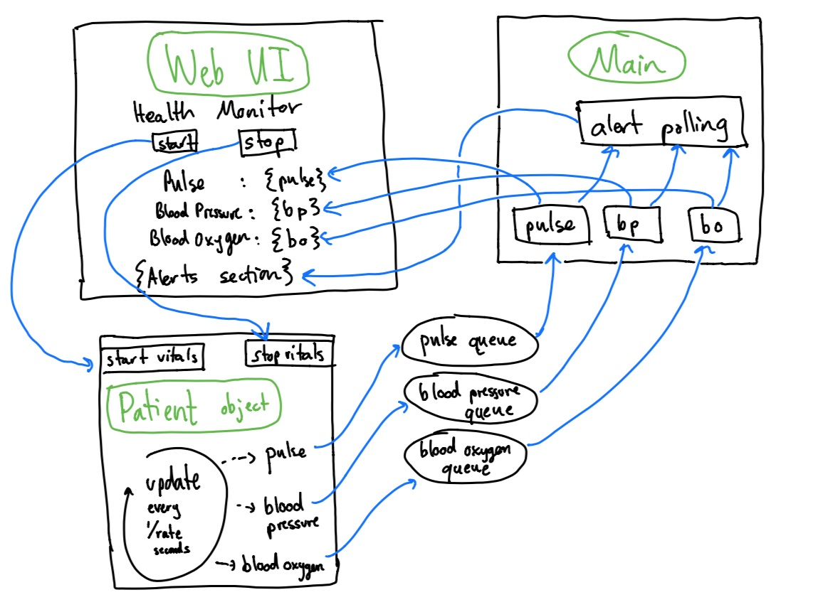

# EC500: Health Monitor Project

# Project Architecture

# Project Roles

* Alex: Health Indicator
* Chris: Error Handling
* Jacob: Alerts, Patient classes
* Justin: BP Module, Communication With Personal Device
* Noah: Pulse Module, Timer
* Varun: Blood Oxygen, AI Module

# Architecture: Patient Class
Wraps the generation of vitals in a class that pushes vitals values for blood pressure, pulse, and blood oxygen to queues that can be defined in main, and monitored/used by the GUI in a separate thread.

Note: The UnhealthyPatient class will behave as a child class and have more turbulent behavior
