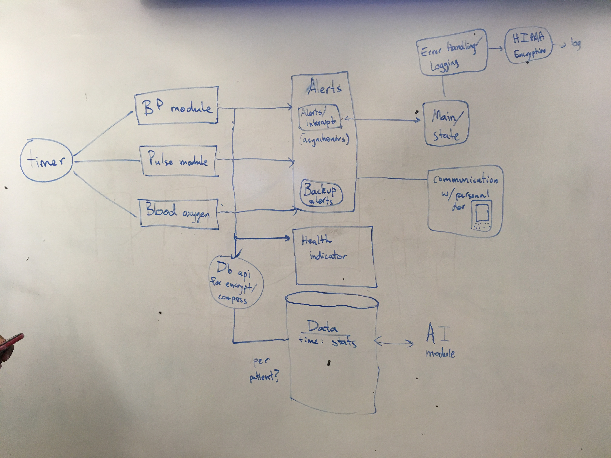

# EC500: Health Monitor Project

# Project Architecture

# Project Roles

Alex: Health Indicator
Chris: Error Handling
Jacob: Alerts
Justin: BP Module, Communication With Personal Device
Noah: Pulse Module, Timer
Varun: Blood Oxygen, AI Module
